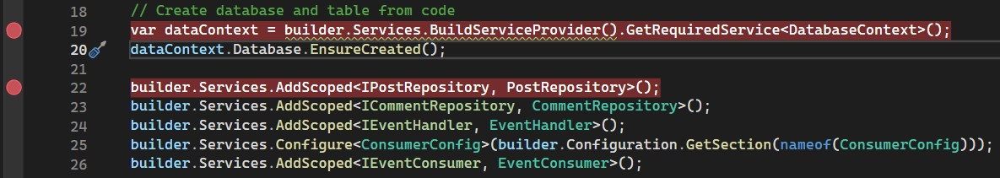
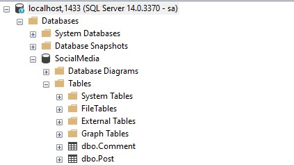
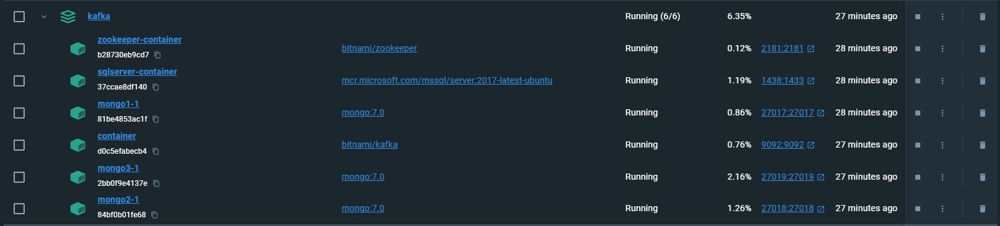
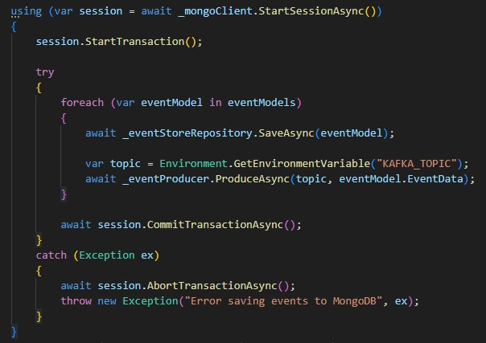
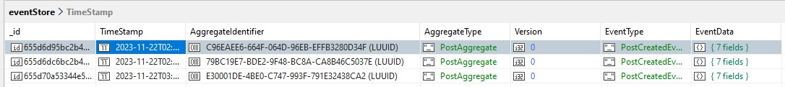
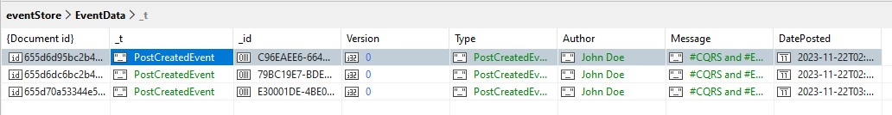

# CQRS and Event Sourcing with kafka

The project is for learning how to create microservices in C# that are based on CQRS and Event Sourcing.
The virtual network has been set for databases and kafka including zookeeper in docker containers which is extremely useful in future deployments into the cloud infrastructure.

## Creating containers
First, we need to create a network where our resources will communicate.
```
docker network create --attachable -d bridge mydockernetwork
```
`attachable` means that we can attach our resources later

Running the command
```
docker-compose up -d 
```
creates a kafka stream on a port `9092` with zookeper service on the port `2181`.

Then create container for mongo-db:
```
docker run -it -d --name mongo-container -p 27017:27017 --network mydockernetwork --restart always -v mongodb_data_container:/data/db mongo:latest
```
In order to connect to a new mongo db, install one of the clients for it. 

The second container would be for MSSQL:
```
docker run --name sql-container --network mydockernetwork --restart always -e ACCEPT_EULA=Y -e MSSQL_SA_PASSWORD=MyComplexPassword!234 -e MSSQL_PID=Express -p 1433:1433 -d mcr.microsoft.com/mssql/server
```

## Setup Database
We are using the EF and code to create programmatically required for us Read DB (mssql).
We need to run the `Post.Query.Api` project for the first time and set up a breakpoint to make sure that the change has been applied successfully:


`appsettings.Development.json` should be set to:
```
  "ConnectionStrings": {
    "SqlServer": "Server=localhost,1433;Database=SocialMedia;User Id=sa;Password=MyComplexPassword!234"
  },
```
After the code is executed the new `SocialMedia` should be created on your server:


There is a script to create a new database user and set their role to owner:
```
Use SocialMedia
GO

IF NOT EXISTS(SELECT * FROM sys.server_principals WHERE name = 'SMUser')
BEGIN
	CREATE LOGIN SMUser WITH PASSWORD=N'SmPA$$06500', DEFAULT_DATABASE=SocialMedia
END

IF NOT EXISTS(SELECT * FROM sys.server_principals WHERE name = 'SMUser')
BEGIN
	EXEC sp_adduser 'SMUser', 'SMUser', 'db_owner';
END
```
The appsettings should be changed accordingly
```
"SqlServer": "Server=(localdb)\\mssqllocaldb;Database=SocialMedia;User Id=SMUser;Password=SmPA$$06500;Trusted_Connection=True;Encrypt=False"
```
but for the simplicity we use `sa` in the code.

**Important**: The file `Post.Query.Api\appsettings.Development.json` should have the setting:
```
  "ConsumerConfig": {
    "GroupId": "SM_Consumer",
    "BootstrapServers": "localhost:9092",
    "EnableAutoCommit": false,
    "AutoOffsetReset": "Earliest",
    "AllowAutoCreateTopics": true
  }
```
`BootstrapServers` shouldn't have `http` prefix but just point out to the server where it is running like it is shown above `localhost:9092`! The same important setting is on the Producer side:
```
  "ProducerConfig": {
    "BootstrapServers": "localhost:9092"
  }
```

## Docker compose
The `docker-compose-full.yml` has been implemented to to run all services at once:

**Note**: docker-compose should be updated to version `v2.23.1`,
[Install Compose standalone](https://docs.docker.com/compose/install/standalone/).

Run the command - `docker-compose up` with `-f` key.
Note, that the syntax of `docker-compose` is such that `-f` needs to be before `up/down`, and thereafter `-d`:
```
docker-compose -f docker-compose-full.yml up -d` 
```
The command shoulb be run from the `./kafka` folder with the file that lives there.

There was another challenge to make mongo db work with transactions in `EventStore` class. 


**Note**: Mongo DB transaction is required replica set which is spinned up in docker-compose file.
```
mongo1:
    image: mongo:7.0
    command: ["--replSet", "rs0", "--bind_ip_all", "--port", "27017"]
    ports:
      - 27017:27017
    extra_hosts:
      - "host.docker.internal:host-gateway"
    healthcheck:
      test: echo "try { rs.status() } catch (err) { rs.initiate({_id:'rs0',members:[{_id:0,host:'host.docker.internal:27017',priority:1},{_id:1,host:'host.docker.internal:27018',priority:0.5},{_id:2,host:'host.docker.internal:27019',priority:0.5}]}) }" | mongosh --port 27017 --quiet
      interval: 5s
      timeout: 30s
      start_period: 0s
      start_interval: 1s
      retries: 30
    volumes:
      - "mongo1_data:/data/db"
      - "mongo1_config:/data/configdb"
    networks:
      - parse_network
  mongo2:
    image: mongo:7.0
    command: ["--replSet", "rs0", "--bind_ip_all", "--port", "27018"]
    depends_on:
      - mongo1
    ports:
      - 27018:27018
    extra_hosts:
      - "host.docker.internal:host-gateway"
    volumes:
      - "mongo2_data:/data/db"
      - "mongo2_config:/data/configdb"
    networks:
      - parse_network
  mongo3:
    image: mongo:7.0
    command: ["--replSet", "rs0", "--bind_ip_all", "--port", "27019"]
    depends_on:
      - mongo1
    ports:
      - 27019:27019
    extra_hosts:
      - "host.docker.internal:host-gateway"
    volumes:
      - "mongo3_data:/data/db"
      - "mongo3_config:/data/configdb"
    networks:
      - parse_network
```

For the dependent replica, it is important to have this line:
```
    depends_on:
      - mongo1
```
Also, we need to make sure that all our resources are running under the same virtual network:
```
    networks:
      - parse_network
```
There are more about yaml file setup in the article [Establishing a Docker-based MongoDB Replica Set](https://copyprogramming.com/howto/setting-up-mongo-replica-set-in-docker)

## Getting records from mango db
`Studio T3` is used to look the records in mango db.
Standard command to obtain records from the table:
```
db.getCollection("eventStore").find({})
```

You might look into more details of the `event` in `EventData`:

## Postman collection
Import the postman collection from [here](./dev-tools/).